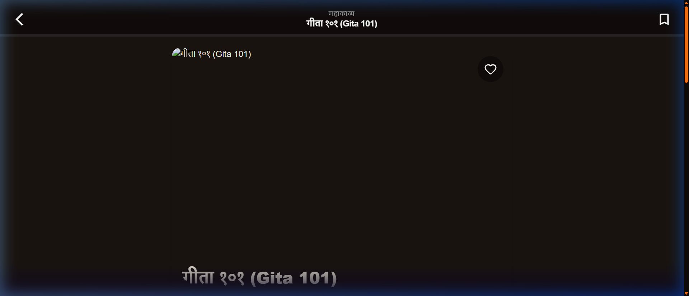

<div align="center">

# 🕉️ KATHA
### *Smart Cultural Storyteller*


**Bringing Ancient Indian Epics to Life for the Gen Z Digital Native Generation.**

*Duolingo × Netflix × AI — for the Ramayana, Mahabharata & Bhagavad Gita.*

---

[](https://reactjs.org/)
[](https://fastapi.tiangolo.com/)
[](https://docker.com/)
[](https://elevenlabs.io/)
[](https://vercel.com/)
[](https://render.com/)
[](LICENSE)

---

## 🚀 Live Deployment

| Service | URL | Status |
|:--------|:----|:-------|
| 🌐 **Frontend** (Vercel) | [`https://YOUR-APP.vercel.app`](https://YOUR-APP.vercel.app) | [](https://YOUR-APP.vercel.app) |
| ⚡ **Backend API** (Render) | [`https://YOUR-BACKEND.onrender.com`](https://YOUR-BACKEND.onrender.com) | [](https://YOUR-BACKEND.onrender.com/docs) |
| 📖 **API Docs** (Swagger) | [`/docs`](https://YOUR-BACKEND.onrender.com/docs) | [](https://YOUR-BACKEND.onrender.com/docs) |

> 🔑 **Demo login:** `demo@katha.com` / `demo123`

---

## ⚡ One-Click Deploy

[](https://vercel.com/new/clone?repository-url=https://github.com/shru089/katha-smart-storyteller&root=frontend&env=VITE_API_BASE_URL&envDescription=Your%20Render%20backend%20URL)
&nbsp;&nbsp;
[](https://render.com/deploy?repo=https://github.com/shru089/katha-smart-storyteller)

</div>

---

## 📖 Table of Contents

- [About the Project](#-about-the-project)
- [Screenshots](#-screenshots)
- [Features](#-features)
- [Architecture](#-architecture)
- [Technology Stack](#-technology-stack)
- [Project Structure](#-project-structure)
- [Getting Started](#-getting-started)
- [Docker Setup](#-docker-setup)
- [Deployment Guide](#-deployment-guide)
- [AI Pipeline](#-ai-pipeline)
- [Database Schema](#-database-schema)
- [API Reference](#-api-reference)
- [Gamification System](#-gamification-system)
- [9 Rasa Emotion Moods](#-9-rasa-emotion-moods)
- [Future Roadmap](#-future-roadmap)
- [Author](#-author)

---

## 🌟 About the Project

**Katha** is a full-stack, AI-powered cultural storytelling platform that transforms how Gen Z engages with ancient Indian epics. It combines RPG gamification, emotion-aware AI narration, AI-generated visual reels, and an interactive sacred geography map into one immersive mobile-first experience.

### The Problem
> *Gen Z has an 8-second average attention span. Traditional scripture formats have a 0% retention rate.*

- 📖 Archaic Sanskrit translations create impenetrable language barriers
- 😴 Static text cannot compete with TikTok, Netflix, or gaming
- 🎮 Zero progression mechanics means zero motivational scaffolding
- 🌍 73% of youth report feeling culturally disconnected from ancient epics

### The Solution
Katha reimagines ancient wisdom for digital natives by combining:
- 🎮 **RPG Gamification** — XP, streaks, archetypes, 20+ dynamic badges
- 🎙️ **Emotion-Aware AI Narration** — ElevenLabs v2 with 9 Rasa mood mappings
- 🎬 **AI Visual Reels** — Pollinations Flux 9:16 cinematic scene cards
- 🗺️ **Interactive Sacred Map** — Real-world Leaflet.js mythology geography
- 📱 **Mobile-First Dark Aesthetic** — Glassmorphism + saffron palette

---

## 🖼️ Screenshots

| Story Details — Bhagavad Gita | AI Cyberpunk Visual Reel |
|:-----------------------------:|:------------------------:|
|  |  |

---

## ✨ Features

### 🎮 RPG Gamification System
- **4 Archetypes** via personality quiz onboarding — Warrior, Sage, Seeker, Guardian
- **XP System** — Scene (+10), Chapter (+50), Story (+500), Daily Streak (+25/day)
- **20+ Dynamic Badges** — "Sita's Grace", "Hanuman's Devotion", "Arjuna's Resolve"
- **Level Progression** — Scholar → Devotee → Legend tiers with visual celebration modals

### 🎙️ Theatrical AI Narration
- **ElevenLabs v2 Multilingual TTS** — Cinematic voice with emotion parameter tuning
- **3-Mode Dialogue Parser** — Script format (`Krishna: ...`), quoted speech, natural language
- **9 Rasa Mood Mappings** — Stability/clarity/similarity parameters per emotion
- **Edge-TTS Fallback** — Zero-cost local synthesis, <200ms latency

### 🎬 AI Visual Reels
- **Pollinations Flux Realism** — 9:16 mobile-format AI images per scene
- **Emotion-Based Prompts** — Cultural keywords + Rasa modifier per generation
- **VideoModal** — Auto-detects image vs. video, full-screen immersive view
- **Content Safety** — Keyword validation rejects anachronistic/disrespectful prompts

### 🗺️ Interactive Sacred Geography Map
- **Real Coordinates** — Ayodhya, Kurukshetra, Lanka, Dwarka, Panchavati & more
- **Dark CartoDB Tiles** — Premium dark-mode Leaflet map aesthetic
- **Historical Metadata** — Epoch, era, and cultural significance per location
- **Animated Bounce Markers** — Custom icons with hover info panels

### 📖 Chapter Reader — Novel + Webtoon Hybrid
- **Drop-Cap Serif Typography** — Newsreader font for editorial gravitas
- **Full-Bleed AI Illustrations** — Pollinations-generated per chapter
- **Floating Audio Dock** — Seek bar, play/pause, progress indicator
- **Framer Motion Scroll** — `useScroll` + `useSpring` reading progress bar

### 🤖 Rishi AI Oracle
- In-scene AI cultural companion for symbolism & philosophy Q&A
- Context-aware responses tied to active scene
- RasaPanel mood selector + SwipeHandler navigation integration

### 🔐 Auth & User Profiles
- JWT authentication with `python-jose`, bcrypt password hashing
- Full profile management with archetype display and XP stats
- Progress sync across devices via backend DB

---

## 🏗️ Architecture

```
┌─────────────────────────────────────────────────────────────────┐
│              TIER 1 — React Frontend (Vercel CDN)               │
│  Home · ChapterReader · SceneViewer · ReelsPage · MapPage       │
│  ArchetypeQuiz · ProfilePage · ExplorePage · Achievements        │
└──────────────────────────┬──────────────────────────────────────┘
                           │  HTTPS + REST API + JWT Bearer
┌──────────────────────────▼──────────────────────────────────────┐
│        TIER 2 — FastAPI Backend (Render.com + Docker)           │
│  users.py · stories.py · chapters.py · audio.py · scenes.py    │
│                    (apt-get ffmpeg ✅)                           │
└──────────┬─────────────────────────────┬────────────────────────┘
           │                             │
┌──────────▼──────────┐    ┌─────────────▼────────────────────────┐
│  TIER 3 — DATABASE  │    │         AI SERVICES LAYER            │
│  SQLite → PostgreSQL│    │  ElevenLabs v2  ·  Edge-TTS fallback │
│  SQLModel ORM       │    │  Pollinations Flux  ·  Pydub + FFmpeg│
└─────────────────────┘    └──────────────────────────────────────┘
```

### Data Flow
```
User Action  →  React Frontend  →  FastAPI Router  →  SQLModel ORM  →  SQLite
                                          ↓
                                   AI Service Layer
                               (ElevenLabs / Edge-TTS / Pollinations)
                                          ↓
                               Static File Storage (audio/, videos/)
                                          ↓
                                JSON Response  →  Frontend UI Update
```

> 🐳 **Why Docker is non-negotiable:** Standard Render Python buildpacks do NOT include `ffmpeg`. The `Dockerfile` explicitly runs `apt-get install ffmpeg` — without this, all AI audio generation crashes at runtime.

---

## 🛠️ Technology Stack

| Layer | Technology | Purpose |
|:------|:-----------|:--------|
| **Frontend** | React 18 + TypeScript + Vite | Type-safe reactive SPA |
| **Styling** | TailwindCSS + Custom CSS | Glassmorphism dark mode, saffron palette |
| **Animation** | Framer Motion | Spring physics, shared layoutId, scroll |
| **Routing** | React Router v6 | Client-side navigation + auth guards |
| **HTTP** | Axios + JWT Interceptors | Auto-auth refresh on API calls |
| **Maps** | Leaflet + React-Leaflet | Interactive sacred geography |
| **Icons** | Lucide React | Consistent icon system |
| **Backend** | FastAPI (Python 3.11) | Async REST API + OpenAPI docs |
| **ORM** | SQLModel + SQLAlchemy | Type-safe database interactions |
| **Database** | SQLite → PostgreSQL | Serverless MVP → production scale |
| **AI Audio** | ElevenLabs v2 Multilingual | Emotion-aware cinematic narration |
| **AI Fallback** | Microsoft Edge TTS | Zero-cost local speech synthesis |
| **Audio Proc.** | Pydub + FFmpeg | MP3 concat, dB normalization |
| **AI Images** | Pollinations Flux Realism | Prompt-engineered scene visuals |
| **Auth** | JWT (python-jose) + bcrypt | Stateless authentication |
| **Container** | Docker + docker-compose | Reproducible dev/prod environments |
| **Deploy** | Render + Vercel | Cloud backend + CDN frontend |

---

## 📂 Project Structure

```
katha-smart-storyteller/
├── backend/
│   ├── app/
│   │   ├── api/
│   │   │   ├── users.py              # Auth, registration, profile
│   │   │   ├── stories.py            # Story CRUD + search + filter
│   │   │   ├── chapters.py           # Chapter + scene management
│   │   │   ├── scenes.py             # Scene + AI generation trigger
│   │   │   ├── audio.py              # Narration pipeline endpoint
│   │   │   └── debug.py              # Seeding + dev utilities
│   │   ├── services/
│   │   │   ├── elevenlabs_service.py       # ElevenLabs v2 integration
│   │   │   ├── enhanced_audio_service.py   # Dialogue parsing + concat
│   │   │   ├── fast_video_service.py       # Pollinations image pipeline
│   │   │   ├── gamification_service.py     # XP, badges, streak engine
│   │   │   └── seed_service.py             # Sample Ramayana data
│   │   ├── models.py                 # SQLModel table definitions (8 entities)
│   │   ├── db.py                     # Database session + engine
│   │   └── main.py                   # FastAPI app + CORS + router mount
│   ├── static/
│   │   ├── audio/                    # Generated MP3 narrations
│   │   └── videos/fast/              # Generated 9:16 JPEG scene images
│   ├── requirements.txt
│   └── Dockerfile                    # Multi-stage + apt-get ffmpeg
├── frontend/
│   ├── src/
│   │   ├── components/
│   │   │   ├── StoryCard.tsx         # Grid story cards (landscape + portrait)
│   │   │   ├── Chip.tsx              # Dynamic category/emotion tags
│   │   │   ├── ContinueReadingCard.tsx  # Progress dashboard widget
│   │   │   ├── layout/               # MobileLayout, BottomNavbar
│   │   │   ├── reel/                 # AudioControl, RasaPanel, RishiChat
│   │   │   ├── map/                  # Map, MapPin, InfoPanel components
│   │   │   └── achievements/         # BadgeGrid, JourneyHeader
│   │   ├── pages/
│   │   │   ├── Home.tsx              # Main dashboard + continue reading
│   │   │   ├── ExplorePage.tsx       # Story browse + filter + search
│   │   │   ├── StoryDetails.tsx      # Story overview + chapter list
│   │   │   ├── ChapterReader.tsx     # Immersive novel + webtoon reader
│   │   │   ├── SceneViewer.tsx       # Full-screen scene + Rishi AI
│   │   │   ├── ReelsPage.tsx         # AI visual reel feed
│   │   │   ├── MapPage.tsx           # Interactive sacred geography map
│   │   │   ├── ArchetypeQuiz.tsx     # Personality quiz onboarding
│   │   │   ├── ProfilePage.tsx       # User stats + edit profile
│   │   │   └── Achievements.tsx      # Badge showcase + XP history
│   │   ├── api/
│   │   │   └── client.ts             # Axios instance + typed API calls
│   │   └── utils/
│   │       ├── readingProgress.ts    # LocalStorage progress tracking
│   │       └── notifications.tsx     # Toast achievement celebration system
│   ├── tailwind.config.js
│   ├── vite.config.ts
│   └── package.json
├── docs/
│   └── deployment_guide.md           # Full production deployment reference
├── scripts/
│   ├── generate_ppt.js               # 15-slide pptxgenjs presentation builder
│   └── generate_report.js            # Academic project report generator
├── screenshots/                      # App screenshots for README + docs
├── docker-compose.yml                # One-command full-stack local launch
├── render.yaml                       # Render.com Blueprint auto-deploy config
├── generate_ppt.ps1                  # Windows PowerShell PPT launcher
└── README.md
```

---

## 🚀 Getting Started

### Prerequisites

- **Python** 3.11+
- **Node.js** 18+
- **npm** 9+
- **Docker** (optional, for containerized setup)

### 1. Clone the Repository

```bash
git clone https://github.com/shru089/katha-smart-storyteller.git
cd katha-smart-storyteller
```

### 2. Backend Setup

```bash
cd backend

# Install dependencies
pip install -r requirements.txt

# Create environment file
cp .env.example .env
```

Edit `.env`:
```env
JWT_SECRET_KEY=your-super-secret-key-here
ELEVENLABS_API_KEY=your-elevenlabs-key     # Optional — Edge-TTS fallback used if absent
CORS_ORIGINS=http://localhost:5173
```

```bash
# Start the API server
uvicorn app.main:app --host 0.0.0.0 --port 8081 --reload
```

- API: `http://localhost:8081`
- Swagger Docs: `http://localhost:8081/docs`

### 3. Frontend Setup

```bash
cd frontend

# Install dependencies
npm install

# Create environment file
cp .env.example .env
```

Edit `.env`:
```env
VITE_API_BASE_URL=http://localhost:8081/api
```

```bash
# Start the dev server
npm run dev
```

App: `http://localhost:5173`

### 4. Seed Sample Data

```bash
# Via curl
curl -X POST "http://localhost:8081/api/debug/seed-data?reset=true"

# Or click the "Seed Data" button on the Home page (dev mode)
```

---

## 🐳 Docker Setup

Run the entire stack with a single command:

```bash
# Build and start all services
docker-compose up --build

# Frontend: http://localhost:5173
# Backend:  http://localhost:2000
# API Docs: http://localhost:2000/docs
```

```bash
# Stop all services
docker-compose down

# Rebuild after code changes
docker-compose up --build --force-recreate
```

> 💡 The `Dockerfile` runs `apt-get install -y ffmpeg` to ensure AI audio generation works correctly. This is **required** — standard Python buildpacks do not include FFmpeg.

---

## ☁️ Deployment Guide

### Backend → Render.com

1. Push this repo to your GitHub account
2. Go to [render.com](https://render.com/) → **Blueprints** → **New Blueprint Instance**
3. Connect your GitHub repo — Render auto-detects `render.yaml`
4. Set environment variables in the Render dashboard:

| Variable | Value |
|:---------|:------|
| `JWT_SECRET_KEY` | A long random string |
| `ELEVENLABS_API_KEY` | Your ElevenLabs key (optional) |
| `CORS_ORIGINS` | Your Vercel frontend URL (add after deploy) |

5. Click **Apply** → Your backend deploys at `https://YOUR-BACKEND.onrender.com`

### Frontend → Vercel

1. Go to [vercel.com](https://vercel.com/) → **Add New Project** → import this repo
2. Set **Root Directory** → `frontend`
3. Framework preset will auto-detect **Vite**
4. Set environment variable:

| Variable | Value |
|:---------|:------|
| `VITE_API_BASE_URL` | `https://YOUR-BACKEND.onrender.com/api` |

5. Click **Deploy** → Copy your live URL
6. Go back to Render → Update `CORS_ORIGINS` with your Vercel URL

### 🔄 Update Links in this README

Replace these placeholders once deployed:
- `YOUR-APP.vercel.app` → your actual Vercel URL
- `YOUR-BACKEND.onrender.com` → your actual Render URL

---

## 🤖 AI Pipeline

### Audio Generation Flow

```
User triggers narration
        ↓
POST /api/scenes/{id}/generate
        ↓
Parse raw_text → dialogue segments
(3 modes: "Speaker: text" | quoted | natural language)
        ↓
    ElevenLabs configured?
    YES → ElevenLabs v2 Multilingual
           Rasa emotion → stability/clarity params
    NO  → Edge-TTS (local, zero-cost, <200ms)
           Custom rate/pitch per character
        ↓
Pydub: concatenate segments + normalize dB
        ↓
Save → static/audio/{scene_id}.mp3
        ↓
Update Scene.ai_audio_url in DB
        ↓
Return { success: true, audio_url: "..." }
```

### Image Generation Flow

```
Scene visualization request
        ↓
Build prompt: reel_script + Rasa emotion + cultural keywords
        ↓
GET https://image.pollinations.ai/prompt/{encoded_prompt}
    ?enhance=true&width=1080&height=1920&nologo=true
        ↓
Keyword safety validation (rejects anachronistic prompts)
        ↓
Save JPEG → static/videos/fast/{scene_id}.jpg
        ↓
Update Scene.ai_video_url in DB
```

---

## 🎭 9 Rasa Emotion Moods

| Rasa | Meaning | Audio Effect | Visual Style |
|:-----|:--------|:-------------|:-------------|
| **Shringara** | Love / Romance | Soft, lyrical, warm | Golden warm tones |
| **Hasya** | Humor / Joy | Light, elevated pitch | Bright, vibrant |
| **Karuna** | Sorrow / Compassion | Gentle, subdued | Desaturated blues |
| **Raudra** | Fury / Anger | Deep, powerful | Dark crimson |
| **Veera** | Heroism / Courage | Bold, strong | Epic golds |
| **Bhayanaka** | Fear / Dread | Tense, urgent | Dark shadows |
| **Adbhuta** | Wonder / Amazement | Elevated, breathy | Cosmic purples |
| **Shanta** | Peace / Serenity | Calm, measured | Soft sage greens |
| **Bibhatsa** | Disgust | Moderate, flat | Muted neutrals |

---

## 🗄️ Database Schema

```
USER ──(1:N)── USER_SCENE_PROGRESS ──(N:1)── SCENE ──(N:1)── CHAPTER ──(N:1)── STORY
  │
  └──(1:N)── USER_BADGE ──(N:1)── BADGE

LOCATION (standalone — sacred geography)
```

| Table | Key Fields |
|:------|:-----------|
| `USER` | id, name, email, password_hash, total_xp, current_streak_days, archetype |
| `STORY` | id, title, slug, category, cover_image_url, total_chapters |
| `CHAPTER` | id, story_id FK, index, title, short_summary, cover_image_url |
| `SCENE` | id, chapter_id FK, raw_text, reel_script, ai_emotion, ai_audio_url, ai_video_url |
| `USER_SCENE_PROGRESS` | user_id FK, scene_id FK, completed, xp_earned, completed_at |
| `BADGE` | id, code UNIQUE, name, description, icon_url, unlock_condition |
| `USER_BADGE` | user_id FK, badge_id FK, earned_at |
| `LOCATION` | id, name, description, lat, lon, epoch, era |

> **Migration path:** SQLite (dev) → PostgreSQL (prod) via `DATABASE_URL` environment variable. SQLModel auto-migrates on startup.

---

## 📡 API Reference

Interactive Swagger docs at: `https://YOUR-BACKEND.onrender.com/docs`

| Method | Endpoint | Auth | Description |
|:-------|:---------|:----:|:------------|
| `POST` | `/api/users/register` | ❌ | Create account |
| `POST` | `/api/users/login` | ❌ | Authenticate → receive JWT |
| `GET` | `/api/users/me` | ✅ | Current user profile |
| `PUT` | `/api/users/me` | ✅ | Update profile |
| `GET` | `/api/stories/` | ❌ | List stories (with category filter) |
| `GET` | `/api/stories/{id}` | ❌ | Story detail + chapters |
| `GET` | `/api/chapters/{id}/scenes` | ✅ | All scenes in chapter |
| `POST` | `/api/scenes/{id}/generate` | ✅ | Trigger AI audio + image generation |
| `POST` | `/api/scenes/{id}/complete` | ✅ | Mark scene read, award XP |
| `GET` | `/api/locations/` | ❌ | Sacred geography points |
| `GET` | `/api/users/me/badges` | ✅ | User badge collection |
| `POST` | `/api/debug/seed-data` | ❌ | Seed sample Ramayana data |
| `GET` | `/health` | ❌ | Health check + DB status |

---

## 🎮 Gamification System

### Archetype Quiz

```
3 Questions → Accumulate scores (Warrior / Sage / Seeker / Guardian)
       ↓
Highest score wins → Saved to User.archetype in DB
       ↓
Badge + XP awarded → Achievement modal shown
```

| Archetype | Traits | Badge Unlocked |
|:----------|:-------|:--------------|
| **Warrior** | Courage, action, duty | Arjuna's Resolve |
| **Sage** | Wisdom, contemplation | Vyasa's Pen |
| **Seeker** | Curiosity, discovery | Narada's Veena |
| **Guardian** | Loyalty, protection | Bhishma's Oath |

### XP System

| Action | XP Reward |
|:-------|:----------|
| Scene completed | +10 XP |
| Chapter completed | +50 XP |
| Story completed | +500 XP |
| Archetype quiz | +100 XP |
| Daily streak | +25 XP/day |
| Badge unlocked | +50 XP |

---

## 🗺️ Future Roadmap

### Phase 2 — Advanced AI (3–6 months)
- [ ] Stable Video Diffusion — cinematic 4–6s scene video clips
- [ ] Celery + Redis async task queue (non-blocking AI generation)
- [ ] AWS S3 / Cloudflare R2 cloud media storage
- [ ] Hindi/Sanskrit neural translation + regional voice models
- [ ] React Native iOS + Android apps

### Phase 3 — Platform Scale (6–12 months)
- [ ] Full Rishi AI Oracle — LLM-powered cultural Q&A (context-aware)
- [ ] Multiplayer cooperative reading quest lines
- [ ] Creator marketplace — community storytellers submit adaptations
- [ ] Teacher dashboard + classroom mode + analytics
- [ ] Offline PWA with service workers + IndexedDB

### Phase 4 — Venture Scale (12+ months)
- [ ] WebXR / VR immersive mythology experiences
- [ ] UNESCO cultural preservation formal partnership
- [ ] Expand to Puranas, Panchatantra, regional folklore (50+ texts)
- [ ] AI-powered adaptive personalized narrative paths
- [ ] Content licensing + premium publisher partnerships

---

## 🤝 Contributing

Contributions are welcome!

1. Fork the repository
2. Create a feature branch: `git checkout -b feature/amazing-feature`
3. Commit your changes: `git commit -m 'feat: add amazing feature'`
4. Push to branch: `git push origin feature/amazing-feature`
5. Open a Pull Request

---

## 👩‍💻 Author

<div align="center">

**Shrishti Singh**
B.Tech CSE (AI/ML), 3rd Year · CSMU, Panvel, Navi Mumbai · AI Minor @ IIT Ropar

[](https://linkedin.com/in/shrishti-singh-455566348)
[](https://github.com/shru089)
[](mailto:shrishtis089@gmail.com)

</div>

---

## 📄 License

MIT License — Built with ❤️ to preserve and modernize global cultural heritage.

---

<div align="center">

*🕉️ "Na jayate mriyate va kadacit" — It is never born, nor does it ever die.*
**Bhagavad Gita 2.20**

---

⭐ **Star this repo** if Katha inspires you!

[](https://github.com/shru089/katha-smart-storyteller/stargazers)
[](https://github.com/shru089/katha-smart-storyteller/network/members)

</div>