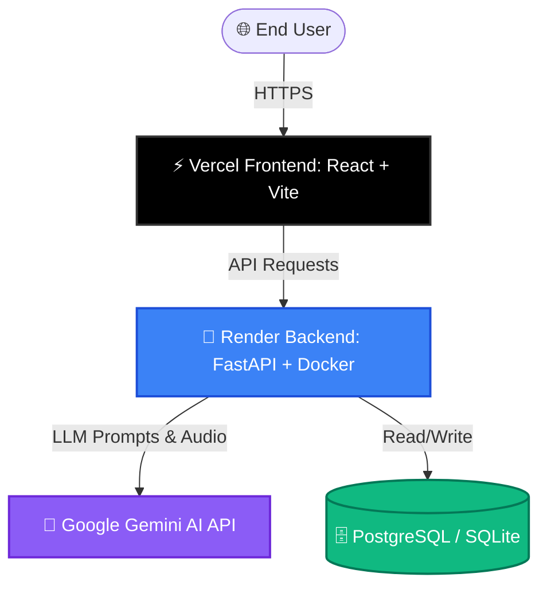

# 🚀 Katha Deployment & Architecture Guide

This blueprint provides a comprehensive guide to deploying the **Katha - Smart Cultural Storyteller** platform to production using **Vercel** (for the React/Vite frontend) and **Render** (for the FastAPI backend). It also addresses why we should keep Docker and how it fits into the overall developer workflow.

---

## 🗺️ High-Level Service Architecture



---

## 🐳 Question 1: Should we keep Docker as it is?

**Yes, absolutely! Keep Docker exactly as it is.** 

Docker plays a critical dual role in this project:

### 1. The Local Development Powerhouse
Setting up local Python environments, Node.js tools, and native OS dependencies across different machines (Windows, macOS, Linux) is highly error-prone. 
* With [docker-compose.yml](../docker-compose.yml), anyone can clone this repository and spin up the complete, working ecosystem (frontend, backend, database seeds) in **one command**:
  ```bash
  docker-compose up --build
  ```
* It guarantees that the database initializes and seeds the demo user and locations automatically on startup.

### 2. Solving the `ffmpeg` Native OS Dependency (Critical for Audio)
The Katha platform is a cultural storyteller that features an AI audio integration (e.g., text-to-speech, audio generation). Audio processing libraries in Python require the system-level binary **`ffmpeg`**.
* **The Problem:** Standard cloud buildpacks (like Render's default Python builder or Vercel's Serverless environment) **do not** include `ffmpeg` by default, causing standard Python backends to crash when attempting audio operations.
* **The Solution:** Our [backend/Dockerfile](../backend/Dockerfile) explicitly installs `ffmpeg` on the underlying system:
  ```dockerfile
  RUN apt-get update && apt-get install -y \
      ffmpeg \
      gcc \
      && rm -rf /var/lib/apt/lists/*
  ```
* Because Render supports **Dockerized Web Services**, we can deploy the backend using this `Dockerfile`. Render will build the image, and the backend will run with `ffmpeg` natively and flawlessly out-of-the-box.

---

## 🚀 Section 1: Deploying the Backend on Render

We will use Render to host the FastAPI backend. Render's **Blueprint Instances** make this extremely easy because we have already provided a [render.yaml](../render.yaml) file at the root.

### Step-by-Step Render Setup

1. **Push your code to GitHub**: Ensure the latest changes are committed and pushed to a remote GitHub repository.
2. **Log into Render**: Create or log into your account at [render.com](https://render.com/).
3. **Deploy using Blueprints**:
   * Click **New +** at the top right of the dashboard and select **Blueprint**.
   * Connect your GitHub account and select your `katha-smart-storyteller` repository.
   * Render will automatically discover your [render.yaml](../render.yaml) file.
   * Name your group (e.g., `katha-production`) and click **Apply**.
4. **Configure Environment Variables**:
   While the blueprint automatically sets up standard configurations, you must provide your private secrets in the Render dashboard:
   * Go to your newly created **`katha-backend`** Web Service in the dashboard.
   * Navigate to the **Environment** tab.
   * Add the following missing variables:
     
     | Environment Variable | Value | Description |
     | :--- | :--- | :--- |
     | `GEMINI_API_KEY` | `AIzaSy...` | Your Google Gemini API Key |
     | `CORS_ORIGINS` | `https://katha.vercel.app` | **Your Vercel URL** (update this once your Vercel deployment is live) |

> [!NOTE]
> Render will automatically trigger a new deployment when these environment variables are updated.
> The backend's health check is located at `/health` and will show as green once the database has initialized.

---

## ⚡ Section 2: Deploying the Frontend on Vercel

Vercel is the premier platform for hosting static frontend assets. Since Katha's frontend is a React + Vite + TypeScript application, Vercel will build and serve it over a global CDN.

We have already configured [vercel.json](../frontend/vercel.json) in the `frontend` subfolder to handle routing, security headers, and single-page application (SPA) rewrites.

### Step-by-Step Vercel Setup

1. **Log into Vercel**: Sign up or log into [vercel.com](https://vercel.com).
2. **Import Project**:
   * Click **Add New** -> **Project**.
   * Connect your GitHub account and select the `katha-smart-storyteller` repository.
3. **Configure Project Settings** (Crucial for Monorepo):
   * **Root Directory**: Click *Edit* and select the **`frontend`** directory. (Do not deploy the root directory directly, as Vite resides inside `frontend`).
   * **Framework Preset**: Vercel will auto-detect **Vite**. If not, manually select **Vite** from the dropdown.
   * **Build and Output Settings**:
     * Build Command: `npm run build`
     * Output Directory: `dist`
     * Install Command: `npm install`
4. **Add Environment Variables**:
   Expand the **Environment Variables** section and add the API connection parameter:
   
   * **Key:** `VITE_API_BASE_URL`
   * **Value:** `https://your-backend-name.onrender.com` (Your Render Web Service URL)
   
5. **Deploy**: Click **Deploy**. Vercel will compile the React app and give you a live URL (e.g., `https://katha-frontend.vercel.app`).

> [!IMPORTANT]
> Once Vercel gives you your live frontend URL, copy it, return to your **Render Backend Dashboard**, and update the `CORS_ORIGINS` environment variable to match this URL exactly (without a trailing slash). This prevents browser cross-origin blocking!

---

## 🗄️ Section 3: Database & Persistence Strategy

In [db.py](../backend/app/db.py), the database connects dynamically based on the environment:

```python
DATABASE_URL = os.getenv("DATABASE_URL", "sqlite:///./katha.db")
```

### Option A: SQLite (Default/Prototype)
* **How it works:** Render spins up a Docker container with an ephemeral SQLite database `katha.db`. 
* **Drawback:** Every time Render spins down due to inactivity or rebuilds on git pushes, **all created stories, active sessions, and user records are reset**. 
* **How to keep it persistent:** If you want to stick with SQLite but keep your data safe, you must add a **Persistent Disk** in the Render Dashboard under **Disks** (`Mount Path: /app/data`) and change your `DATABASE_URL` to `sqlite:////app/data/katha.db`.

### Option B: PostgreSQL (Recommended for Production)
For production-level persistence, we highly recommend spinning up a free Render PostgreSQL database.
1. In the Render Dashboard, click **New +** and select **PostgreSQL**.
2. Name it `katha-db` and click **Create Database**.
3. Once provisioned, copy the **Internal Database URL**.
4. Go to your **`katha-backend`** Web Service on Render.
5. In the **Environment** tab, find `DATABASE_URL` and change its value to your copied PostgreSQL connection string (starts with `postgresql://`).
6. Save changes. FastAPI will automatically re-run database migrations and seed the core tables into PostgreSQL.

---

## 🏁 Section 4: Post-Deployment Verification Checklist

After deploying both services, run through these verification steps to ensure Katha is running seamlessly:

- [ ] **Health Check**: Open `https://your-backend-name.onrender.com/health` in your browser. It should return:
  ```json
  {"status":"healthy","database":"connected"}
  ```
- [ ] **Swagger Documentation**: Verify the interactive API docs are accessible at `https://your-backend-name.onrender.com/docs`.
- [ ] **Login Flow**: Open your Vercel frontend URL, head to the Sign In page, and attempt to log in using the seeded credentials:
  * **Email**: `demo@katha.com`
  * **Password**: `demo123`
- [ ] **AI Wiseman (Rishi)**: Navigate to the interactive chatbot or story-generation engine. Submit a prompt to verify the connection between Render -> Gemini API -> Vercel.
- [ ] **Audio Narration**: Generate or play a story audio segment to confirm `ffmpeg` is successfully executing inside the Docker environment on Render.
