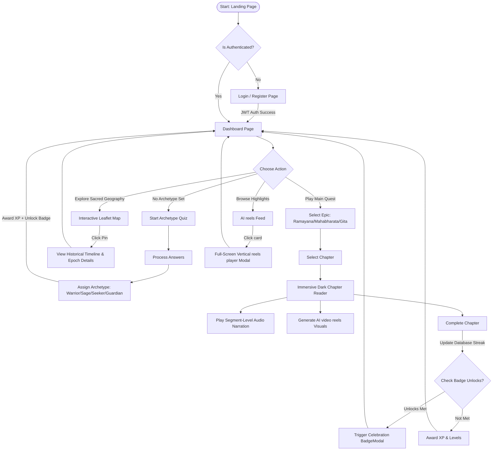
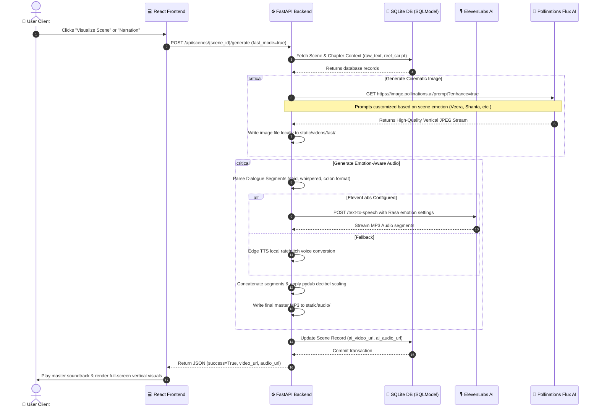
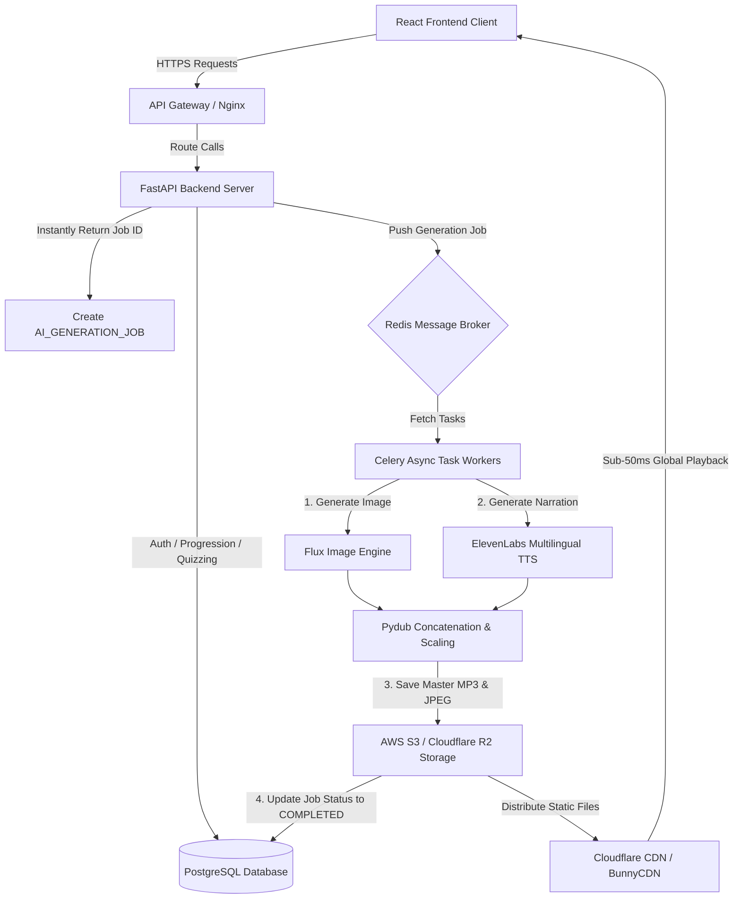

# 📊 Katha - Process Diagrams & Flowcharts

This document compiles the complete visual architecture suite for **Katha**, providing high-resolution flowcharts, sequence diagrams, database entity models, and production-scale architectures. 

You can render these diagrams dynamically in any Markdown reader (like GitHub or VS Code) or export them to PNG/PDF using Mermaid.

---

## 🚀 1. Complete User Journey Flowchart
This chart maps the step-by-step lifecycle of a user inside the Katha ecosystem—from initial signup to daily gamification loops.



---

## ⏱️ 2. AI Audio & Video Generation Sequence Diagram
This diagram outlines the step-by-step API communication between the React frontend client, the FastAPI backend server, and the external AI generation engines.



---

## 🏗️ 3. Recommended Production-Scale Architecture Diagram
This diagram outlines our enterprise scaling roadmap, introducing API gateways, Redis brokers, Celery async task workers, cloud media storage, and CDN caches.



---

## 🗄️ 4. Expanded Database Entity-Relationship (ER) Diagram
This database schema models the SQLModel relationships, fully detailing our expanded advanced production tables (`USER_SESSION`, `STORY_PROGRESS`, `AI_GENERATION_JOB`, `USER_ANALYTICS`).

```mermaid
erDiagram
    USER {
        int id PK
        string name
        string username UNIQUE
        string email UNIQUE
        string password_hash
        int total_xp
        int current_streak_days
        int longest_streak_days
        date last_active_date
        string archetype
    }
    
    USER_SESSION {
        int id PK
        int user_id FK
        string refresh_token_hash
        string ip_address
        string device_info
        timestamp expires_at
    }

    STORY_PROGRESS {
        int id PK
        int user_id FK
        int story_id FK
        float percent_complete
        int last_chapter_id
        boolean completed
    }

    USER_ANALYTICS {
        int id PK
        int user_id FK
        int session_duration_seconds
        int stories_completed
        string favorite_archetype
        float retention_score
    }

    STORY {
        int id PK
        string title
        string slug UNIQUE
        string description
        string category
        string cover_image_url
        int total_chapters
        int total_scenes
    }
    
    CHAPTER {
        int id PK
        int story_id FK
        int index
        string title
        string short_summary
        string cover_image_url
    }
    
    SCENE {
        int id PK
        int chapter_id FK
        int index
        string raw_text
        string reel_script
        string ai_emotion
        string ai_video_url
        string ai_audio_url
    }
    
    AI_GENERATION_JOB {
        string id PK
        int scene_id FK
        string status
        string generation_type
        timestamp started_at
        timestamp completed_at
        string error_message
    }
    
    USER_SCENE_PROGRESS {
        int id PK
        int user_id FK
        int scene_id FK
        bool completed
        datetime completed_at
        int xp_earned
    }
    
    BADGE {
        int id PK
        string code UNIQUE
        string name
        string description
        string icon_url
        string unlock_condition
    }
    
    USER_BADGE {
        int id PK
        int user_id FK
        int badge_id FK
        datetime earned_at
    }

    LOCATION {
        int id PK
        string name
        string description
        float lat
        float lon
        string epoch
        string era
    }

    USER ||--o{ USER_SESSION : manages
    USER ||--o{ STORY_PROGRESS : aggregates
    USER ||--o{ USER_ANALYTICS : tracks
    USER ||--o{ USER_SCENE_PROGRESS : tracks
    SCENE ||--o{ USER_SCENE_PROGRESS : completes
    SCENE ||--o{ AI_GENERATION_JOB : queues
    USER ||--o{ USER_BADGE : earns
    BADGE ||--o{ USER_BADGE : unlocks
    STORY ||--o{ CHAPTER : contains
    CHAPTER ||--o{ SCENE : contains
```

---

## 🏗️ 5. MVC Platform Component Architecture
This block diagram separates frontend client-side modules from backend server-side resources, illustrating high-level project packaging.

```mermaid
graph TD
    subgraph Frontend Client (React + Vite)
        A1[Router: App.tsx] --> A2[Pages: Home / StoryDetails / ChapterReader / Reels / Profile]
        A2 --> A3[Components: Map / BottomNavbar / VideoModal / BadgeModal]
        A3 --> A4[API Client: Axios Wrapper]
    end
    
    subgraph Backend Server (FastAPI + SQLModel)
        B1[Application: main.py] --> B2[Routers: users / stories / chapters / scenes / debug / audio]
        B2 --> B3[Services: gamification_service / seed_service / enhanced_audio_service / fast_video_service]
        B3 --> B4[Database Layer: db.py / models.py]
    end
    
    A4 -->|REST API Requests| B1
```
