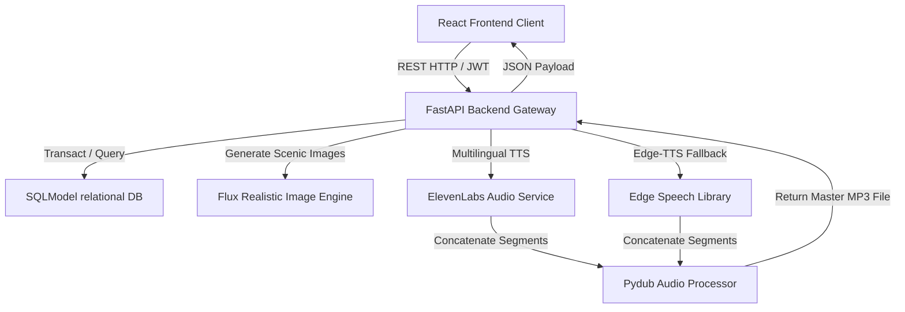
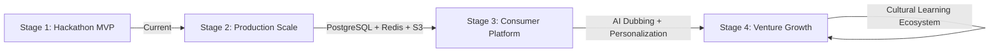

# 📖 Engineering & Project Report: Katha - Smart Cultural Storyteller

**An AI-assisted storytelling platform utilizing emotion-aware narration and gamified progression to modernize cultural epics.**

---

## 1. Executive Summary
Katha is a gamified, AI-assisted cultural storytelling platform designed to address the growing cultural disconnect and low attention spans of modern digital native users (Gen Z). By blending gamified progression schemas (RPGs, streaks, achievements) with Leaflet-based interactive maps, dynamic audio segment orchestration, and automated Flux visual diffusion workflows, Katha turns classical Indian epics (the Ramayana, Mahabharata, and Bhagavad Gita) into an active, immersive learning experience.

---

## 2. Technical Stack

| Tier | Component | Rationale |
| :--- | :--- | :--- |
| **Frontend** | React (TypeScript) + Vite | Dynamic page state transitions, asynchronous API rendering, and hot module reloading. |
| **Styling** | Custom Vanilla CSS + HSL | Curated earth/amber dark-mode palette, premium glassmorphism, responsive vertical layouts. |
| **Backend** | FastAPI (Python 3.11) | High-performance asynchronous routes, fast serialization, and clean Pydantic validations. |
| **Database** | SQLModel + SQLite | Structured relational schema mapping with direct SQL migrations and lightweight footprint. |
| **AI Audio** | ElevenLabs v2 Multilingual | Emotion-aware high-fidelity theatrical voiceovers mapping the 9 classical Indian Rasas. |
| **Local Audio** | Microsoft Edge TTS | Resilient local text-to-speech fallback using dynamic rate and pitch modulations. |
| **AI Visuals** | Flux Realism (Pollinations) | Breathtaking, hyper-realistic, prompt-engineered digital concept art tailored to visual dialogue. |

---

## 3. Platform Architecture & Data Flow

Katha uses a decoupled client-server architecture. The frontend handles immersive reading panels, Leaflet map views, and vertical media players, while the backend FastAPI service manages relational databases, progression, and external AI orchestrations.



---

## 4. Database Schema Expansion & Advanced Entities
To transition Katha from a Hackathon MVP into an enterprise-ready consumer application, we expanded the core entity schemas in SQLite/PostgreSQL:

### 🗄️ 4.1. Core Production Relational Models
* **USER:** Handles user identifiers, credentials hashes, levels, daily streaks, last active markers, and archetype records.
* **STORY:** Maintains epic titles, unique slugs, covers, and chapter aggregations.
* **CHAPTER:** Links stories to their sequential titles and short narrative summaries.
* **SCENE:** Contains the raw textbook narration text and the corresponding screenplay dialogue (`reel_script`).
* **USER_SCENE_PROGRESS:** Records individual completions, timestamps, and XP gains.

### 🚀 4.2. Advanced Production Tables
To address scaling bottlenecks and telemetry tracking, the following enterprise models are designed for production deployment:

#### 1. USER_SESSION
Tracks active user session security, device footprints, and manages secure JWT refresh rotation.
```sql
CREATE TABLE user_session (
    id INTEGER PRIMARY KEY AUTOINCREMENT,
    user_id INTEGER NOT NULL,
    refresh_token_hash VARCHAR(255) NOT NULL,
    ip_address VARCHAR(45),
    device_info VARCHAR(255),
    created_at TIMESTAMP DEFAULT CURRENT_TIMESTAMP,
    expires_at TIMESTAMP NOT NULL,
    FOREIGN KEY(user_id) REFERENCES user(id) ON DELETE CASCADE
);
```

#### 2. STORY_PROGRESS
Aggregates overall reading progress for each story, allowing fast dashboard query rendering without recalculating multiple scene joins.
```sql
CREATE TABLE story_progress (
    id INTEGER PRIMARY KEY AUTOINCREMENT,
    user_id INTEGER NOT NULL,
    story_id INTEGER NOT NULL,
    percent_complete FLOAT DEFAULT 0.0,
    last_chapter_id INTEGER,
    completed BOOLEAN DEFAULT FALSE,
    updated_at TIMESTAMP DEFAULT CURRENT_TIMESTAMP,
    FOREIGN KEY(user_id) REFERENCES user(id) ON DELETE CASCADE,
    FOREIGN KEY(story_id) REFERENCES story(id) ON DELETE CASCADE
);
```

#### 3. AI_GENERATION_JOB
Crucial for decoupling expensive, high-latency AI calls from synchronous API request-response loops.
```sql
CREATE TABLE ai_generation_job (
    id VARCHAR(50) PRIMARY KEY,
    scene_id INTEGER NOT NULL,
    status VARCHAR(20) DEFAULT 'PENDING', -- PENDING, PROCESSING, COMPLETED, FAILED
    generation_type VARCHAR(20),          -- AUDIO, IMAGE, VIDEO
    started_at TIMESTAMP DEFAULT CURRENT_TIMESTAMP,
    completed_at TIMESTAMP,
    error_message TEXT,
    FOREIGN KEY(scene_id) REFERENCES scene(id) ON DELETE CASCADE
);
```

#### 4. USER_ANALYTICS
Collects user interaction events to drive engagement optimizations and investor retention telemetry.
```sql
CREATE TABLE user_analytics (
    id INTEGER PRIMARY KEY AUTOINCREMENT,
    user_id INTEGER NOT NULL,
    session_duration_seconds INTEGER DEFAULT 0,
    stories_completed INTEGER DEFAULT 0,
    favorite_archetype VARCHAR(50),
    retention_score FLOAT DEFAULT 1.0,
    created_at TIMESTAMP DEFAULT CURRENT_TIMESTAMP,
    FOREIGN KEY(user_id) REFERENCES user(id) ON DELETE CASCADE
);
```

---

## 5. Enterprise Scalability & Security Blueprint

### 🛠️ 5.1. Asynchronous Background Task Queue
In the current MVP, AI audio and visual generations run synchronously. For scalable production:
* **Message Broker:** Integrate **Redis** as a lightweight message broker.
* **Task Workers:** Deploy **Celery** or **Dramatiq** background task workers.
* **Worker Execution Flow:** The backend API accepts requests, creates an `AI_GENERATION_JOB` with state `PENDING`, pushes the task to Redis, and immediately returns a job ID to the client. The Celery worker processes image/audio rendering asynchronously and updates the database, while the client polls the job endpoint or listens via WebSockets.

### ☁️ 5.2. Cloud Media Storage & CDN Distribution
Rather than storing multi-gigabyte audio/video folders locally inside the container (which leads to container bloat and slow file lookups):
* **Cloud Storage:** Mount **AWS S3** or **Cloudflare R2** via boto3.
* **CDN Caching:** Configure **Cloudflare CDN** or **BunnyCDN** in front of S3 endpoints to serve media files with sub-50ms latency.

### 🛡️ 5.3. Security Hardening
* **JWT Refresh Rotation:** Implement dual-token JWT setups (short-lived access tokens, database-hashed long-lived refresh tokens).
* **API Rate Limiting:** Add slow-api limiters on expensive AI routes using Redis Token Buckets to prevent DDoS/API abuse.
* **Input Sanitization:** Add strict text validators on search, profile edit, and community routes.

### 🧠 5.4. AI Safety & Scripture Moderation Layer
* **Moderation Pipeline:** Introduce a pre-generation moderation filter (e.g. OpenAI/Gemini safety filters) to detect sensitive or inappropriate prompt injection.
* **Scriptural Canonical Mapping:** To prevent scripture hallucination, all storytelling descriptions contain deep references to canon (Book/Chapter/Verse references), ensuring maximum respect and accuracy.

---

## 6. Startup-Grade Evolution Path



* **Stage 1 (Hackathon MVP - Current):** Single-server FastAPI, local SQLite, synchronous AI orchestrations, responsive dark-mode Vite client.
* **Stage 2 (Production Scale):** Migration to PostgreSQL database, Redis caching, Celery async task workers, and S3 media storage.
* **Stage 3 (Consumer Platform):** Multi-language AI voice dubbing (Hindi, Sanskrit), personalized story recommendation feeds, and PWAs for offline access.
* **Stage 4 (Venture Growth):** Global interactive cultural learning ecosystem, community writing portals, and VR/AR cultural experiences.

---

## 7. System Design Interview Explanation

If asked to explain Katha's technical architecture during an engineering interview:

> **"Katha uses a decoupled client-server architecture built on React and FastAPI. The frontend client leverages lightweight components, HSL typography tokens, leafet maps, and specialized HTML5 media fallbacks, communicating with the backend over secure JSON web tokens.**
>
> **The FastAPI backend orchestrates high-fidelity audio/image generation pipelines using ElevenLabs and Flux, with Edge-TTS serving as a resilient zero-cost fallback system. User state, progression metrics, and story entities are structured relationally using SQLModel.**
>
> **To transition this MVP to an enterprise-grade platform, we would introduce Redis-backed Celery task queues to execute generation jobs asynchronously, migrate the SQLite layer to PostgreSQL with PGVector for scriptural context mapping, and serve generated media assets globally using Cloudflare CDN in front of AWS S3 buckets."**
